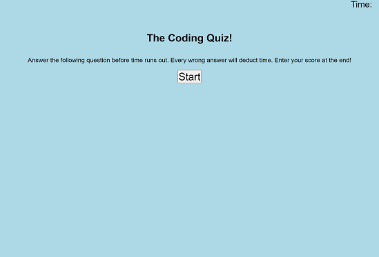

# the-coding-quiz

## Description

This is supposed to be a functioning javascript code quiz.

## Features

When you click start you are presented with a series of questions along with a countdown timer. For each question you get wrong,
the timer subtracts 5 seconds. When you are done you can save your high score along with your initials

## Links

<a href="https://vilas-izquierdo.github.io/the-password-generator/">Deployed Page</a>

<a href="https://github.com/vilas-izquierdo/the-password-generator">GitHub</a>k